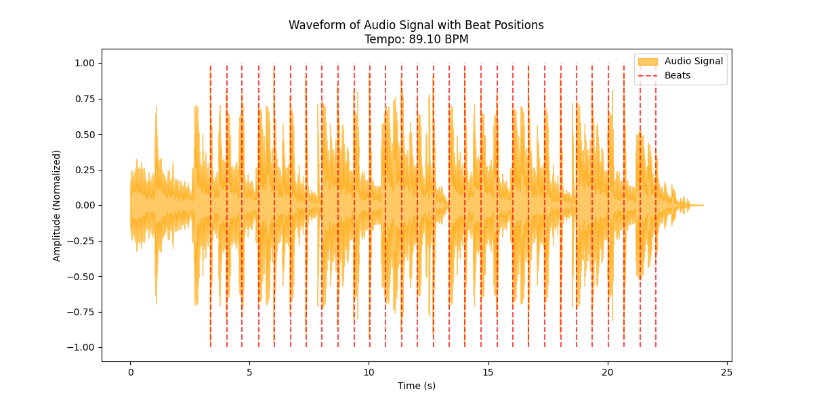

# Loudly-Assignment - Beat Tracking with Librosa

This project performs beat tracking on an audio file using Python's `librosa` library. 
It detects beats, estimates the tempo (BPM), and visualizes the waveform with beat positions.

## Features
- Estimates the tempo of an audio file in **beats per minute (BPM)**.
- Detects beat positions and marks them on the waveform.
- Uses `librosa` for audio processing and `matplotlib` for visualization.


## Thought Process
Given that I haven't worked with libraries for beat tracking, I did some research on python libraries that can perform this task.
I found the `librosa` library and its documentation, which I found very complete and clear.
I proceeded to install it using conda (I had already numpy and matplotlib installed in my computer).

```sh
conda install librosa
```

After the installation I created a repository in github, cloned it locally, created a new python file which I called "Beat Tracking.py", in the same folder I saved the loudly.mp3
that was provided and using some of the examples from the librosa documentation, I got the tempo from the audio file.
After this I looked up how to display the waveform using matplotlib and Librosa, it turned out to be relatively simple as the function librosa.frames_to_time converts beat frames into seconds
and librosa also has a function called "librosa.display.waveshow" which will display the waveform of the time frames in seconds.
Finally I assigned the y-imits of the plot (-1, 1), marked the beats in red and displayed te waveform in orange. Also assigned the title and lables for the x and y axis.
I got an error when first doing this:

TypeError: unsupported format string passed to numpy.ndarray.__format__

After investigating, I found that tempo was being returned as a NumPy array instead of a single float. The error occurred because I attempted to format it using :.2f, which only works with scalar values (like int or float).
To fix this, I extracted the scalar value from the array using .item():

print(f"Estimated tempo: {tempo.item():.2f} beats per minute")

With this the code compiled and I was able to show the results:




## What other musical aspects would be interesting to analyze?
I think it would be very interesting to analyze the rythm of the song which I believe is defined by the beat spacing.
And the Harmonics, which is connected to major and minor keys and the respective chord sequences.
